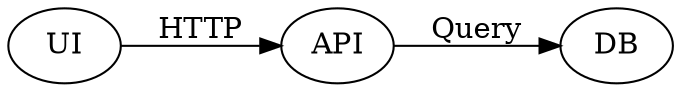

# Ivy Framework Weekly Notes - Week of 2026-04-07

> [!NOTE]
> We usually release on Fridays every week. Sign up on [https://ivy.app/](https://ivy.app/auth/sign-up) to get release notes directly to your inbox.

## Charts

### Dual-axis series

Bar, Line, Area, and [Scatter](https://docs.ivy.app/widgets/charts/scatter-chart) series support `YAxisIndex` so each series can bind to the correct Y axis in a dual-axis chart.

```csharp
new BarChart(data)
    .Bar(new Bar("Revenue", 1).YAxisIndex(0))
    .Bar(new Bar("GrowthRate", 2).YAxisIndex(1));
// Line / Area: chain .Line(new Line("Key").YAxisIndex(n)) the same way
```

### Axis generation and layout

`generateYAxis` skips `largeSpread` heuristics when multiple axes are active. Cartesian charts reclaim plot width when axes are hidden, and grid padding no longer reserves space for hidden axes.

Hidden axes (horizontal bar sample, `BarChartApp.cs`, `BarChart3`):

```csharp
new BarChart(data)
    .Vertical()
    .Bar(new Bar("Desktop", 1).Radius(4) /* … */)
    .YAxis(new YAxis("Month").TickLine(false).AxisLine(false).Type(AxisTypes.Category).Hide())
    .XAxis(new XAxis("Desktop").Type(AxisTypes.Number).Hide());
```

Full dual-axis bar example (`BarChartApp.cs`, `BarChart10`):

```csharp
var data = new[]
{
    new { Month = "Jan", Revenue = 4500, GrowthRate = 5 },
    new { Month = "Feb", Revenue = 5200, GrowthRate = 15 },
    // ...
};

return new Card().Title("Dual Axis (Revenue vs Growth Rate)")
    | new BarChart(data)
        .ColorScheme(ColorScheme.Default)
        .Bar(new Bar("Revenue", 1).YAxisIndex(0).Radius(8).LegendType(LegendTypes.Square))
        .Bar(new Bar("GrowthRate", 2).YAxisIndex(1).Radius(8).LegendType(LegendTypes.Square))
        .CartesianGrid(new CartesianGrid().Horizontal())
        .Tooltip()
        .XAxis(new XAxis("Month").TickLine(false).AxisLine(false))
        .YAxis(new YAxis("Revenue")
            .Orientation(YAxis.Orientations.Left)
            .TickFormatter("C0"))
        .YAxis(new YAxis("GrowthRate")
            .Orientation(YAxis.Orientations.Right)
            .TickFormatter("P0")
            .Domain(-0.1, 0.2))
        .Legend();
```

### Bar chart

Vertical bar orientation and ECharts axis pairing were fixed. `YAxis.Hide` and grid padding behave correctly with hidden axes; docs cover `YAxisIndex` on `Bar` and dual-axis setups.

```csharp
.YAxis(new YAxis("Labels").Hide());
```

### Scatter chart

Scatter rejects a category axis where a value axis is required. [ScatterChartApp](https://docs.ivy.app/widgets/charts/scatter-chart) includes a dual-axis example with a numeric X axis for continuous data.

Numeric value axes (`ScatterChartApp.cs`, `ScatterChart1View`):

```csharp
new ScatterChart(data)
    .Scatter(new Scatter("Value").Name("People"))
    .XAxis(new XAxis("Height").Type(AxisTypes.Number))
    .YAxis(new YAxis("Weight").Type(AxisTypes.Number));
```

### Scatter tests and validation

Widget tests cover ScatterChart; the implementation blocks invalid category-axis use for scatter series.

Dual-axis scatter (`ScatterChartApp.cs`, `ScatterChart12View`):

```csharp
var data = new[]
{
    new { Month = 1, Revenue = 150, MarketShare = 12 },
    new { Month = 2, Revenue = 280, MarketShare = 18 },
    // ...
};

return new Card().Title("Dual Axis (Revenue vs Market Share)")
    | new ScatterChart(data)
        .ColorScheme(ColorScheme.Default)
        .Scatter(new Scatter("Revenue").Name("Revenue ($K)").YAxisIndex(0).Shape(ScatterShape.Circle))
        .Scatter(new Scatter("MarketShare").Name("Market Share (%)").YAxisIndex(1).Shape(ScatterShape.Diamond))
        .XAxis(new XAxis("Month").Type(AxisTypes.Number).TickLine(false).AxisLine(false))
        .YAxis(new YAxis("Revenue")
            .Orientation(YAxis.Orientations.Left)
            .TickFormatter("C0"))
        .YAxis(new YAxis("MarketShare")
            .Orientation(YAxis.Orientations.Right)
            .TickFormatter("P0")
            .Domain(0, 0.5))
        .CartesianGrid(new CartesianGrid().Horizontal())
        .Tooltip(new ChartTooltip().Animated(true))
        .Legend();
```

### Line and area series

Line and Area use the same `YAxisIndex` extension as `Bar`.

```csharp
new LineChart(data)
    .Line(new Line("SeriesA").YAxisIndex(0))
    .Line(new Line("SeriesB").YAxisIndex(1))
    .XAxis(new XAxis("Month"))
    .YAxis(new YAxis("Left"))
    .YAxis(new YAxis("Right").Orientation(YAxis.Orientations.Right));
```

### Pie chart

[PieChart](https://docs.ivy.app/widgets/charts/pie-chart) tooltips use a formatter with marker styling for clearer series labels and values.

```csharp
data.ToPieChart(
    e => e.Category,
    e => e.Sum(f => f.Value),
    PieChartStyles.Default);
```

## DataTable and querying

### Decimal and footer formatting

[DataTable](https://docs.ivy.app/widgets/advanced/data-table) decimal columns use a more reliable `valueOf` path with a string fallback. Footer aggregates match column formatting rules for currency and numbers.

### Column expressions

Navigation properties and ternary expressions work more predictably in column expressions.

### Column scaling

Optional auto-exclusion of navigation collection columns from scaling avoids distorted layouts.

### ToDetails and navigation properties

`ToDetails()` no longer shows raw CLR type names for navigation properties.

### Virtual columns

You can define multiple virtual columns from the same root property.

### Sorting and stable order

When `AllowSorting` is false, `ToDataTable` keeps the query’s order. For paging, the query processor adds a default `OrderBy` when a stable sort is required.

```csharp
.Sortable(e => e.Email, sortable: false);
```

### UseDataTable config

`UseDataTable` takes an optional `DataTableConfig` (same shapes on `ViewBase` and `IViewContext`) so options such as sorting and search ride with the connection:

```csharp
var connection = UseDataTable(
    db.Orders.AsQueryable(),
    idSelector: o => o.Id,
    columns: null,
    refreshToken: refresh,
    config: new DataTableConfig
    {
        AllowSorting = false,
        ShowSearch = true,
        BatchSize = 50,
    });
```

### Search

Search includes match navigation, highlights, and a progress indicator for large tables.

```csharp
.Config(c => { c.ShowSearch = true; });
```

### Badge and link cells

Badge cells can use per-value colors. Link cells cooperate with `OnCellClick` without double navigation.

```csharp
.Badges(e => e.Skills, Colors.Sky);
```

### Tooltips on cells

Cells use the shared `withTooltip` wrapper instead of the native `title` attribute.

### Virtual scrolling and height

Virtual scrolling renders rows reliably. Height in unconstrained parents was fixed, with follow-up coverage for a zero-height regression.

### Configuration on fluent `ToDataTable`

For the fluent API, use `.Config(...)` on the table builder (`DataTableApp.cs`, `DataTableMainSample`):

```csharp
mockService.GetEmployees().AsQueryable().ToDataTable(idSelector: e => e.Id)
    .RefreshToken(refreshToken)
    .Header(e => e.Name, "Name")
    // ...
    .Config(config =>
    {
        config.FreezeColumns = 2;
        config.AllowSorting = true;
        config.AllowFiltering = true;
        config.ShowSearch = true;
        config.BatchSize = 50;
        config.LoadAllRows = false;
    });
```

### Documentation

UseQuery + DataTable anti-patterns are clarified for authors and AGENTS (prefer `IQueryable` / `ToDataTable()` where appropriate).

```csharp
// Prefer server-side tables from IQueryable:
entities.AsQueryable().ToDataTable(idSelector: e => e.Id);
```

## Markdown and tables

### Diagrams and fenced code

The [Markdown](https://docs.ivy.app/widgets/primitives/markdown) widget renders Graphviz from ` ```dot ` or ` ```graphviz ` fences (`MarkdownApp.cs`, Diagrams tab). Fences without a language render reliably.



### Tables, images, and spacing

Embedded images use a light border; the Table widget matches markdown table borders. Literal tables inside fences are not rendered as HTML.

### Markdown block spacing

Default container gap is tighter; spacing is tuned per block type instead of one gap everywhere.

## Image

[Image](https://docs.ivy.app/widgets/primitives/image) supports `Overlay` for lightbox viewing; arrow keys move between sibling overlays. Set `Overlay` on the image record (or via the API your version exposes).

```csharp
new Image("https://example.com/photo.jpg")
{
    Alt = "Product shot",
    Caption = "Click to enlarge",
    Overlay = true,
};
```

## Sheet

[Sheet](https://docs.ivy.app/widgets/advanced/sheet) adds a resizable drag handle and more predictable width behavior with explicit sizes and Tailwind-related edge cases.

Opening a sheet from a button (`SheetApp.cs`):

```csharp
new Button("Right (Default)").WithSheet(
    () => new SheetView(),
    title: "Right Sheet",
    description: "This sheet slides in from the right side.",
    width: Size.Rem(24),
    side: SheetSide.Right);
```

## Dialog and AutoFocus

Dialog and Sheet no longer swallow AutoFocus on child inputs (the client may cast to `HTMLElement` where needed). See DialogApp for AutoFocus.

```csharp
searchQuery.ToSearchInput()
    .Placeholder("Type your search query...")
    .AutoFocus();
```

## Tabs and loading

### Close others and tab order

[TabsLayout](https://docs.ivy.app/widgets/layouts/tabs-layout) adds `OnCloseOthers` and refreshes tab order without flicker.

### Tab badges

The Content tab variant supports secondary, smaller badges on tabs.

```csharp
new TabsLayout(OnTabSelect, OnTabClose, null, null, selectedIndex.Value, tabs.Value.ToArray())
    .Variant(TabsVariant.Tabs)
    .Width(Size.Fraction((float)width.Value))
    .AddButton("+", OnAddButtonClick)
    with
{
    OnCloseOthers = ((Action<Event<TabsLayout, int>>)OnTabCloseOthers).ToEventHandler(),
};
```

Tab badges in the same sample:

```csharp
new Tab("Customers", "Customers").Icon(Icons.User).Badge("10");
```

## Layout and chrome

### Layout.Grid

Layout.Grid defaults to top-left alignment; use `AlignContent` if you depended on centered grid content.

```csharp
Layout.Grid().Columns(3).AlignContent(Align.TopLeft)
    | widget1
    | widget2;
```

### Header, footer, and scroll shadow

[HeaderLayout](https://docs.ivy.app/widgets/layouts/header-layout) and [FooterLayout](https://docs.ivy.app/widgets/layouts/footer-layout) add scroll-triggered drop shadows. The shared `useScrollShadow` hook takes a `direction` argument and observes DOM updates (batched with `requestAnimationFrame`).

### Container measurement

Container size measurement retries for nested flex layouts.

## StackedProgress

[StackedProgress](https://docs.ivy.app/widgets/common/progress) is a segmented bar with `OnSelect` / `Selected`. Labels show automatically when any segment has a label.

```csharp
var segments = new[]
{
    new ProgressSegment(30, Colors.Red, "Failed"),
    new ProgressSegment(70, Colors.Green, "Passed"),
};

new StackedProgress(segments)
    .ShowLabels()
    .OnSelect(e => ValueTask.CompletedTask)
    .Selected(1);
```

## Terminal

The Terminal widget exposes `Background` and `Foreground` for surface and text colors. Basic usage (`TerminalApp.cs`):

```csharp
new Terminal()
    .Title("Installation")
    .AddCommand("dotnet tool install -g Ivy.Console")
    .AddOutput("You can use the following command to install Ivy globally.")
    .ShowCopyButton(true);
```

## Detail helper

`Multiline` defaults to `false`. Opt in per field with `ToDetails().Multiline(...)` (`DetailsApp.cs`):

```csharp
record.ToDetails()
    .Multiline(x => x.Description, x => x.Notes);
```

## DiffView

[DiffView](https://docs.ivy.app/widgets/primitives/diff-view) uses a smaller default font.

```csharp
using Ivy.Widgets.DiffView;

new DiffView()
    .Diff(myDiffString)
    .Language("typescript");
```

## Confetti

Confetti uses a shorter duration and fewer particles.

```csharp
new Button("Click")
    .OnClick(() => { /* action */ })
    .WithConfetti(AnimationTrigger.Click);
```

## Buttons and badges

### Badges on controls

[Button](https://docs.ivy.app/widgets/common/button) badges use the outline chip style. [Tab](https://docs.ivy.app/widgets/layouts/tabs-layout) (Content) and [DropDownMenu](https://docs.ivy.app/widgets/common/drop-down-menu) items support badges.

### Badge widget

[Badge](https://docs.ivy.app/widgets/common/badge) renders nothing when text is empty.

### Menu and theme

Menu items accept more color options. ThemeCustomizer empty placeholders are clearer.

### Hover rename

`CardHoverVariant` is now `HoverEffect` on Card, Box, and Image.

```csharp
new Button("Updates", eventHandler, variant: ButtonVariant.Outline).Badge("New");
```

## Inputs and file uploads

### ContentInput

[ContentInput](https://docs.ivy.app/widgets/inputs/content-input) adds attachments, optional `ShortcutKey`, density variants, and invalid states.

### Upload helpers and samples

Upload helpers include `FileAttachmentList`, `validateFileWithToast`, and `useUploadWithProgress` (XMLHttpRequest progress). Samples add Playwright coverage and CodeBlock language grids.

### FolderInput and FileInput

[FolderInput](https://docs.ivy.app/widgets/inputs/folder-input) supports `FolderInputMode` (including full path), full-row activation, and browse `aria-label`. FileInput browse controls expose `aria-label`.

### Other inputs

Textarea submits on Ctrl+Enter / Cmd+Enter. TextInput and SignatureInput gained tests and cleaner demos.

### Dictation and Select

`useDictation` was trimmed; redundant `dictationLanguage` on TextInput was removed. [Select](https://docs.ivy.app/widgets/inputs/select-input) fixes placement when both placeholder and items are set.

Content input with uploads (`ContentInputApp.cs`):

```csharp
var text = UseState("");
var files = UseState(ImmutableArray<FileUpload<byte[]>>.Empty);
var upload = UseUpload(MemoryStreamUploadHandler.Create(files));

return text.ToContentInput(upload)
    .Files(files.Value)
    .Placeholder("Describe the issue... (paste screenshots or drag files)")
    .Accept("image/*,.pdf")
    .MaxFiles(5)
    .Rows(4);
```

Folder input, full path mode (`FolderInputApp.cs`):

```csharp
folder.ToFolderInput(mode: FolderInputMode.FullPath);
```

## Code blocks and languages

The Languages enum uses `Description` for display labels. CodeBlock and samples add PowerShell, Bash/Shell, and FileApp mappings; some samples use a three-column language grid.

```csharp
public enum Languages
{
    [Description("PowerShell")]
    Powershell,
    [Description("Bash")]
    Bash,
}
```

## Accessibility

WCAG work adds `aria-label`s on tooltips, `role="button"` surfaces, and browse controls. DataTable uses the design-system tooltip instead of the native `title` attribute.

## Routing, shell, and apps

### Chrome and tabs

`?chrome=false` stays compatible with newer shell flags. Apps may set `allowDuplicateTabs` (see FileApp in samples).

### Navigation and samples

Shell routing dots were restored. The samples “Setup” app is renamed Settings with a cogs icon. AppRouter tests live in `Ivy.Test`.

## Blades

`IBladeService` is renamed to `IBladeContext`—update DI and `UseService` usages.

```csharp
var bladeController = UseContext<IBladeContext>();
var index = bladeController.GetIndex(this);
bladeController.Push(this, new OtherView(), "Next blade");
```

## Branding and theming

ivy-green and related brand tokens land in CSS; sidebar can use `bg-secondary`. ThemeCustomizer empty states are clearer.

## Keyboard and shortcuts

Global shortcuts use `event.code` on macOS for reliable Option/Command chords. Modifier shortcuts still fire when focus is inside multi-line text areas. Shortcut helpers consolidate under `@/lib/shortcut`.

## Server, auth, and HTTP

### OAuth and SignalR

OAuth callbacks use `LocalRedirect`. SignalR hub tests cover `/ivy/messages`.

### Integration tests and docs middleware

HTTP tests use WebApplicationFactory-style helpers, Ivy.Integration.Tests, and Mock HTTP utilities. Ivy.Docs.Shared forwards to Ivy.Docs.Helpers to avoid duplicate middleware.

## Diagnostics and client logging

Client `logger.info` is now `logger.debug`. `WidgetTree` refresh paths catch errors so a failing view does not collapse the whole tree.

## Tooling, analyzers, and repository hygiene

### Analyzers and style

`IVYSERVICE001` requires `UseService` at the start of `Build()` ([AGENTS.md](https://github.com/Ivy-Interactive/Ivy-Framework/blob/main/AGENTS.md)). IDE0005 and unused-`using` cleanup ran repo-wide.

### Hooks and onboarding

Pre-commit can target frontend paths. Hooks use a barrel export. Agent filter tests and `ivy` CLI Mac notes help onboarding.

## Documentation and AI guidance

### AGENTS and docs content

AGENTS and anti-hallucination docs expand (for example `IBladeContext`, `Server.StartAsync`, and compound widgets). Playwright and widget guidance were split; stale redirects were removed.

### Sidebar and verification

Input doc files were renumbered for stable sidebar order. IvyFrameworkVerification documents process timeouts.

## Ivy Studio and developer workflows

Ivy Studio cloud integration is more stable. IvyFrameworkVerification avoids stuck processes; Cleanup-WorktreeFrontend uses cross-platform path separators.

## Tests (high level)

New or expanded coverage includes AppRouter (`Ivy.Test`), QueryProcessor, DataTable, ScatterChart, `useScrollShadow`, inputs, SignalR, HTTP integration, vite `.test.tsx`, mocks, and coverlet cleanup.

## Breaking changes

### `CardHoverVariant` → `HoverEffect`

Rename hover usage to `HoverEffect` on Card, Box, and Image (shared enum location).

```csharp
new Card(Text.Block("Hello")).Hover(HoverEffect.Shadow);
new Box(Text.Block("Click me")).Hover(HoverEffect.PointerAndTranslate);
new Image("photo.jpg").Hover(HoverEffect.Pointer);
```

### `IBladeService` → `IBladeContext`

Rename DI registrations and `UseService` types from `IBladeService` to `IBladeContext`.

## Bug fixes

- DataTable: decimal `valueOf` fallback; footer aggregates; navigation/ternary expressions; link cells with `OnCellClick`; source order when sorting is off; default `OrderBy` for paging; virtual columns from one root; virtual row rendering and height in unconstrained layouts.
- ToDetails(): no raw type names for navigation properties.
- Arrow serialization for widget payloads via safer `ToString` paths.
- Markdown converter cache invalidation by file content.
- OAuth: `LocalRedirect` on callback.
- CI / build: NuGet globbing with native targets; Docker rustserver on clean builds; CS1566 EmbeddedResource/Vite; embedded names cross-platform; App ID `assets` collision; duplicate middleware registration.
- C# / tests: compilation and project reference fixes for API moves and packages.
