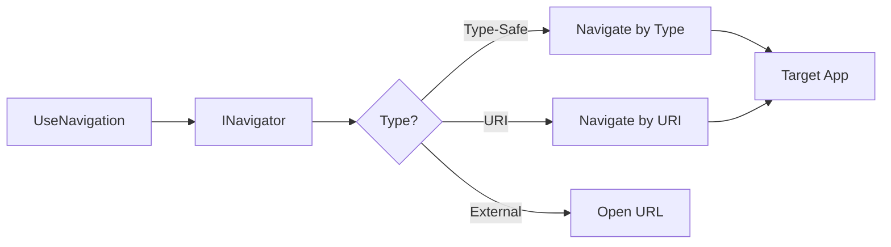

---
searchHints:
  - navigation
  - usenavigation
  - navigate
  - routing
  - route
  - navigation-args
---

# UseNavigation

<Ingress>
The `UseNavigation` [hook](../02_RulesOfHooks.md) provides navigation capabilities, allowing you to programmatically navigate between [apps](../../../01_Onboarding/02_Concepts/15_Apps.md) and routes in your [application](../../../01_Onboarding/02_Concepts/15_Apps.md).
</Ingress>

## Overview

The `UseNavigation` [hook](../02_RulesOfHooks.md) enables programmatic navigation:

- **Type-Safe Navigation** - Navigate to apps using strongly-typed app classes
- **URI-Based Navigation** - Navigate using URI strings for dynamic scenarios
- **Navigation Arguments** - Pass data to target apps during navigation
- **External URL Navigation** - Open external websites and resources

## Basic Usage

```csharp demo-below
public class NavigationExampleView : ViewBase
{
    public override object? Build()
    {
        var navigator = UseNavigation();
        return new Button("Open Ivy Docs", 
            onClick: _ => navigator.Navigate("https://docs.ivy.app"));
    }
}
```

## How Navigation Works



### Type-Safe Navigation

Navigate to apps using their class types for compile-time safety:

```csharp demo-below
public class TypeSafeNavigationView : ViewBase
{
    public override object? Build()
    {
        var navigator = UseNavigation();
        
        return new Button("Navigate to UseService", onClick: _ => 
            {
                navigator.Navigate(typeof(Ivy.Docs.Shared.Apps.Hooks.Core.UseServiceApp));
            });
    }
}
```

### Navigation with Arguments

Pass data to target apps using strongly-typed arguments:

```csharp demo-below
public record UserProfileArgs(int UserId, string Tab = "overview");

public class NavigationWithArgsView : ViewBase
{
    public override object? Build()
    {
        var args = UseArgs<UserProfileArgs>();
        var navigator = UseNavigation();
        
        // If we received arguments, show the target view
        if (args != null)
        {
            return Layout.Vertical()
                | Text.H3("Received Arguments:")
                | Text.P($"UserId: {args.UserId}")
                | Text.P($"Tab: {args.Tab}")
                | new Button("Back", onClick: _ => navigator.Navigate(typeof(Ivy.Docs.Shared.Apps.Hooks.Core.UseNavigationApp)));
        }
        
        // Otherwise, show the navigation source
        var userId = UseState(123);
        var tab = UseState("settings");
        
        return Layout.Vertical()
            | Text.P($"Navigate with UserId: {userId.Value}, Tab: {tab.Value}")
            | new Button("Navigate with Arguments", onClick: _ => 
            {
                navigator.Navigate(typeof(Ivy.Docs.Shared.Apps.Hooks.Core.UseNavigationApp), 
                    new UserProfileArgs(userId.Value, tab.Value));
            })
            | Text.P("Target app receives: var args = UseArgs<UserProfileArgs>();");
    }
}
```

## Best Practices

- **Prefer type-safe navigation** - Use `Navigate(typeof(MyApp))` when target is known at compile time
- **Use records for arguments** - Pass data with strongly-typed argument objects
- **Include protocol for external URLs** - Always use `https://` or `mailto:` for external links
- **Ensure apps have [App] attribute** - Target apps must be decorated with `[App]`

## See Also

- [Navigation Concepts](../../../01_Onboarding/02_Concepts/14_Navigation.md) - Complete navigation documentation
- [Chrome Framework](../../../01_Onboarding/02_Concepts/16_Chrome.md) - App lifecycle and routing
- [App Arguments](./13_UseArgs.md) - Receiving navigation arguments
- [State Management](./03_UseState.md) - Managing state during navigation
