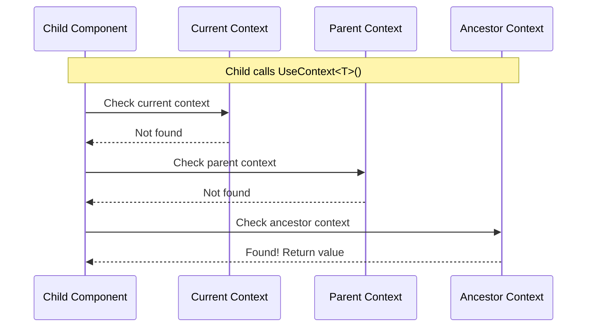

---
searchHints:
  - context
  - usecontext
  - createcontext
  - component-context
  - scoped
  - provider
---

# Context

<Ingress>
The `UseContext` and `CreateContext` [hooks](../02_RulesOfHooks.md) enable component-level context management, allowing you to share data and services within a component tree without prop drilling.
</Ingress>

## Overview

Context [hooks](../02_RulesOfHooks.md) provide a way to share data and services across a component tree:

- **Component Scoping** - Context values are scoped to the component and its children
- **Avoid Prop Drilling** - Share data without passing props through every level
- **Hierarchical Resolution** - Context values can be resolved from parent components
- **Lifecycle Management** - Context values are automatically disposed when the component is disposed

<Callout type="Tip">
Context is different from [services](./11_Service.md). Services are registered globally in your application, while context is scoped to a specific component and its children. Use context for component-specific data and services for application-wide functionality.
</Callout>

## Basic Usage

Use `CreateContext` to create a context value and `UseContext` to retrieve it:

```csharp demo-tabs
public class BasicThemeContext
{
    public string PrimaryColor { get; set; } = "blue";
    public int FontSize { get; set; } = 16;
}

public class BasicContextParentView : ViewBase
{
    public override object? Build()
    {
        // Create a context value that will be available to children
        CreateContext(() => new BasicThemeContext 
        { 
            PrimaryColor = "blue",
            FontSize = 16 
        });
        
        return new BasicContextChildView();
    }
}

public class BasicContextChildView : ViewBase
{
    public override object? Build()
    {
        // Retrieve the theme context from parent
        var theme = UseContext<BasicThemeContext>();
        
        return Text.Block($"Theme: {theme.PrimaryColor}, Font Size: {theme.FontSize}px");
    }
}
```

## How Context Works

### Context Resolution Flow



### Context Scoping

Context values are scoped to the component where they are created:

```csharp
public class AppView : ViewBase
{
    public override object? Build()
    {
        // Context created here
        var userContext = CreateContext(() => new UserContext { UserId = "123" });
        
        return Layout.Vertical(
            new SectionView(),  // Can access userContext
            new AnotherView()   // Can also access userContext
        );
    }
}

public class SectionView : ViewBase
{
    public override object? Build()
    {
        var user = UseContext<UserContext>(); // Works - found in parent
        
        // Create a new context for this section's children
        var sectionConfig = CreateContext(() => new SectionConfig { Title = "Settings" });
        
        return new NestedView(); // Can access both userContext and sectionConfig
    }
}

public class NestedView : ViewBase
{
    public override object? Build()
    {
        var user = UseContext<UserContext>();        // Works - found in ancestor
        var config = UseContext<SectionConfig>();    // Works - found in parent
        
        return Text.Literal($"{config.Title} for {user.UserId}");
    }
}
```

## When to Use Context

### Use Context For

- **Component-Specific Configuration** - Settings that apply to a component subtree
- **Shared State** - Data that multiple child components need without prop drilling
- **Service Instances** - Component-scoped services (different from global services)
- **Theme and Styling** - Theme values that cascade through components
- **Feature Flags** - Feature toggles specific to a component tree

### Use Services Instead For

- **Application-Wide Services** - Services used across the entire application
- **Singleton Services** - Services that should have a single instance
- **Infrastructure Services** - Logging, database, HTTP clients, etc.

## Examples

### Theme Context

```csharp demo-tabs
public class ThemeContext
{
    public string PrimaryColor { get; set; } = "blue";
    public int FontSize { get; set; } = 16;
    public bool DarkMode { get; set; } = false;
}

public class ThemedApp : ViewBase
{
    public override object? Build()
    {
        CreateContext(() => new ThemeContext 
        { 
            PrimaryColor = "purple",
            FontSize = 18,
            DarkMode = true
        });
        
        return Layout.Vertical()
            | new HeaderView()
            | new ContentView();
    }
}

public class HeaderView : ViewBase
{
    public override object? Build()
    {
        var theme = UseContext<ThemeContext>();
        
        return new Card(Text.Block($"Primary Color: {theme.PrimaryColor}, Font Size: {theme.FontSize}px"))
            .Title("Header");
    }
}

public class ContentView : ViewBase
{
    public override object? Build()
    {
        var theme = UseContext<ThemeContext>();
        
        return Text.Block($"Content using theme - Dark Mode: {theme.DarkMode}");
    }
}
```

### User Context

```csharp demo-tabs
public class UserContext
{
    public string UserId { get; set; } = "";
    public string UserName { get; set; } = "";
    public List<string> Permissions { get; set; } = new();
    
    public bool HasPermission(string permission)
    {
        return Permissions.Contains(permission);
    }
}

public class AuthenticatedView : ViewBase
{
    public override object? Build()
    {
        CreateContext(() => new UserContext
        {
            UserId = "123",
            UserName = "John Doe",
            Permissions = new List<string> { "settings:edit", "profile:view" }
        });
        
        return Layout.Vertical()
            | new UserProfileView()
            | new UserSettingsView();
    }
}

public class UserProfileView : ViewBase
{
    public override object? Build()
    {
        var user = UseContext<UserContext>();
        
        return Layout.Vertical()
            | Text.H3($"Welcome, {user.UserName}!")
            | Text.Block($"User ID: {user.UserId}");
    }
}

public class UserSettingsView : ViewBase
{
    public override object? Build()
    {
        var user = UseContext<UserContext>();
        
        if (!user.HasPermission("settings:edit"))
        {
            return Text.Block("You don't have permission to edit settings.");
        }
        
        return Layout.Vertical()
            | Text.Block("Settings Form")
            | Text.P($"Editing settings for {user.UserName}").Small();
    }
}
```

### Component-Scoped Service

```csharp
public interface IDataCache
{
    void Set<T>(string key, T value);
    T? Get<T>(string key);
    void Clear();
}

public class MemoryCache : IDataCache, IDisposable
{
    private readonly Dictionary<string, object> _cache = new();
    
    public void Set<T>(string key, T value)
    {
        _cache[key] = value!;
    }
    
    public T? Get<T>(string key)
    {
        return _cache.TryGetValue(key, out var value) ? (T?)value : default;
    }
    
    public void Clear()
    {
        _cache.Clear();
    }
    
    public void Dispose()
    {
        _cache.Clear();
    }
}

public class DataView : ViewBase
{
    public override object? Build()
    {
        // Create a cache scoped to this component and its children
        var cache = CreateContext(() => new MemoryCache());
        
        return Layout.Vertical(
            new DataListView(),
            new DataDetailView()
        );
    }
}

public class DataListView : ViewBase
{
    public override object? Build()
    {
        var cache = UseContext<IDataCache>();
        
        var cachedData = cache.Get<List<Data>>("dataList");
        if (cachedData == null)
        {
            cachedData = LoadDataFromDatabase();
            cache.Set("dataList", cachedData);
        }
        
        return new Table(cachedData);
    }
    
    private List<Data> LoadDataFromDatabase() => new();
}
```

## Lifecycle Management

Context values that implement `IDisposable` are automatically disposed when the component is disposed:

```csharp
public class ResourceContext : IDisposable
{
    private readonly FileStream _fileStream;
    
    public ResourceContext(string filePath)
    {
        _fileStream = new FileStream(filePath, FileMode.Open);
    }
    
    public void Dispose()
    {
        _fileStream?.Dispose();
    }
}

public class FileView : ViewBase
{
    public override object? Build()
    {
        // ResourceContext will be automatically disposed when FileView is disposed
        var resource = CreateContext(() => new ResourceContext("data.txt"));
        
        return new FileContentView();
    }
}
```

## Best Practices

### Use Context for Component-Scoped Data

Context is perfect for data that should be shared within a component subtree but not globally:

```csharp
// Good: Component-scoped theme
var theme = CreateContext(() => new ThemeContext());

// Bad: Use service for global theme
var theme = UseService<IThemeService>(); // Better for app-wide theme
```

### Keep Context Values Simple

Context values should be simple data containers or lightweight services:

```csharp
// Good: Simple context
public class ConfigContext
{
    public string ApiUrl { get; set; } = "";
    public int Timeout { get; set; } = 30;
}

// Caution: Heavy services should use dependency injection
// Consider using services for complex operations
```

### Use Type Safety

Always use strongly typed context access:

```csharp
// Good: Type-safe
var theme = UseContext<ThemeContext>();

// Bad: Runtime type checking
var theme = UseContext(typeof(ThemeContext));
```

### Avoid Context for Frequently Changing Data

For data that changes frequently, consider using [state](./03_State.md) instead:

```csharp
// Good: Use state for reactive data
var count = UseState(0);

// Context is better for stable configuration
var config = CreateContext(() => new Config());
```

### Document Context Dependencies

Make it clear when a component requires a context:

```csharp
public class ChildView : ViewBase
{
    // This component requires ThemeContext from a parent
    public override object? Build()
    {
        var theme = UseContext<ThemeContext>(); // Will throw if not found
        
        return Text.Literal($"Theme: {theme.PrimaryColor}");
    }
}
```

## Common Patterns

### Provider Component

Create a provider component that sets up context for its children:

```csharp
public class ThemeProvider : ViewBase
{
    private readonly ThemeContext _theme;
    
    public ThemeProvider(ThemeContext theme)
    {
        _theme = theme;
    }
    
    public override object? Build()
    {
        CreateContext(() => _theme);
        return Children; // Render children passed to this component
    }
}
```

### Context with Factory

Use factory functions for lazy initialization:

```csharp
public class DataView : ViewBase
{
    public override object? Build()
    {
        // Context is only created when first accessed
        var cache = CreateContext(() => 
        {
            var c = new MemoryCache();
            c.Initialize();
            return c;
        });
        
        return new DataListView();
    }
}
```

### Conditional Context

Create context conditionally based on state:

```csharp
public class ConditionalView : ViewBase
{
    public override object? Build()
    {
        var isAuthenticated = UseState(false);
        
        if (isAuthenticated.Value)
        {
            var user = UseService<IUserService>().GetCurrentUser();
            CreateContext(() => new UserContext 
            { 
                UserId = user.Id,
                UserName = user.Name 
            });
        }
        
        return isAuthenticated.Value 
            ? new AuthenticatedView() 
            : new LoginView();
    }
}
```

## Troubleshooting

### Context Not Found Error

If `UseContext` throws an exception, the context wasn't created in a parent component:

```csharp
// Error: Context not found
public class ChildView : ViewBase
{
    public override object? Build()
    {
        var theme = UseContext<ThemeContext>(); // Throws InvalidOperationException
        return Text.Literal(theme.PrimaryColor);
    }
}

// Solution: Create context in parent
public class ParentView : ViewBase
{
    public override object? Build()
    {
        CreateContext(() => new ThemeContext { PrimaryColor = "blue" });
        return new ChildView();
    }
}
```

### Context Value Changes

Context values are created once per component. If you need reactive updates, use [state](./03_State.md) instead:

```csharp
// Context value doesn't update reactively
var config = CreateContext(() => new Config { Value = 10 });
// Changing config.Value won't trigger re-renders

// Use state for reactive updates
var config = UseState(new Config { Value = 10 });
// Changing config.Value will trigger re-renders
```

## See Also

- [Services](./11_Service.md) - Application-wide dependency injection
- [State](./03_State.md) - Reactive state management
- [Rules of Hooks](../02_RulesOfHooks.md) - Understanding hook rules and best practices
- [Views](../../../01_Onboarding/02_Concepts/02_Views.md) - Understanding Ivy views and components
