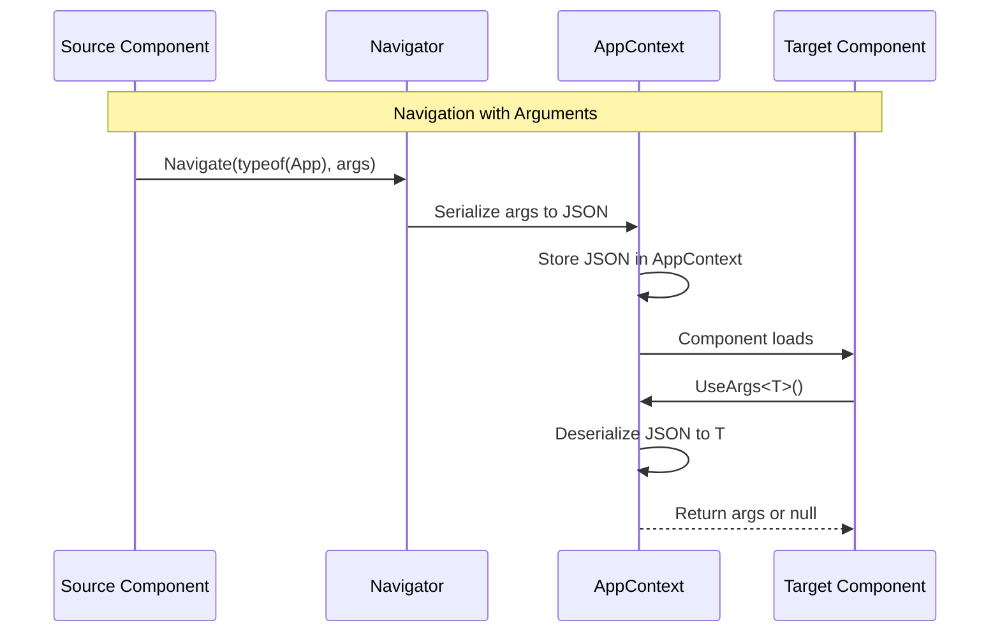

---
searchHints:
  - args
  - useargs
  - parameters
  - route-parameters
  - navigation-args
  - component-args
---

# Args

<Ingress>
The `UseArgs` [hook](../02_RulesOfHooks.md) provides access to arguments passed to a [component](../../../01_Onboarding/02_Concepts/02_Views.md), such as route parameters or navigation arguments.
</Ingress>

## Overview

The `UseArgs` [hook](../02_RulesOfHooks.md) allows you to access component arguments:

- **Navigation Arguments** - Retrieve arguments passed during [navigation](./23_UseNavigation.md)
- **Type Safety** - Strongly typed argument access with compile-time checking
- **JSON Serialization** - Arguments are automatically serialized and deserialized
- **Optional Arguments** - Returns null if arguments are not available

<Callout type="Tip">
`UseArgs` is the primary way to pass data between [components](../../../01_Onboarding/02_Concepts/02_Views.md) during navigation. Arguments are serialized as JSON, making them perfect for passing simple data structures like records or DTOs.
</Callout>

## Basic Usage

Arguments are typically defined as records or classes:

```csharp
public record UserProfileArgs(int UserId, string Tab = "overview");

public record ProductDetailArgs(string ProductId, bool ShowReviews = false);

public class SearchArgs
{
    public string Query { get; set; } = "";
    public string? Category { get; set; }
    public int Page { get; set; } = 1;
}
```

### Passing Arguments During Navigation

Use the [navigation hook](./23_UseNavigation.md) to pass arguments to target components:

```csharp demo-tabs
public record ArgsNavigationUserArgs(int UserId);

public class ArgsNavigationDemo : ViewBase
{
    public override object? Build()
    {
        var navigator = UseNavigation();
        return new Button("View User")
            .HandleClick(() => navigator.Navigate(typeof(ArgsApp), new ArgsNavigationUserArgs(123)));
    }
}
```

### Receiving Arguments

Use `UseArgs` to retrieve arguments in the target component:

```csharp demo-tabs
public record ArgsReceivingUserArgs(int UserId);

public class ArgsReceivingDemo : ViewBase
{
    public override object? Build()
    {
        var args = UseArgs<ArgsReceivingUserArgs>();
        return args == null 
            ? Text.Block("No user ID provided")
            : Text.Block($"User ID: {args.UserId}");
    }
}
```

## How Args Work

### Argument Flow



### Argument Serialization

Arguments are automatically serialized to JSON when passed and deserialized when accessed:

```csharp
// Arguments are serialized to JSON
var args = new UserProfileArgs(123, "details");
// Becomes: {"UserId":123,"Tab":"details"}

// When UseArgs is called, JSON is deserialized back
var receivedArgs = UseArgs<UserProfileArgs>();
// Returns: UserProfileArgs { UserId = 123, Tab = "details" }
```

## When to Use Args

### Use Args For

- **Navigation Data** - Passing data when navigating between components
- **Deep Linking** - Supporting URLs with query parameters
- **Component Initialization** - Providing initial state to components
- **Simple Data Transfer** - Passing small, serializable data structures

### Use [State](./03_State.md) or [Context](./12_Context.md) Instead For

- **Component State** - Data that changes within a component
- **Shared Component Data** - Data shared across a component tree
- **Complex Objects** - Objects with circular references or non-serializable types
- **Real-time Updates** - Data that needs to update reactively

## Examples

### User Profile with Arguments

```csharp
public record UserProfileArgs(int UserId, string Tab = "overview");

public class ArgsUserProfileDemo : ViewBase
{
    public override object? Build()
    {
        var args = UseArgs<UserProfileArgs>();
        if (args == null) return Text.Block("No user provided");
        
        return Layout.Vertical()
            | Text.H3($"User {args.UserId}")
            | Text.Block($"Tab: {args.Tab}");
    }
}
```

### Product Search with Filters

```csharp demo-below
public record ProductSearchArgs(
    string Query,
    string? Category = null,
    decimal? MinPrice = null,
    decimal? MaxPrice = null,
    int Page = 1
);

public class ArgsProductSearchDemo : ViewBase
{
    public override object? Build()
    {
        var args = UseArgs<ProductSearchArgs>();
        var navigator = UseNavigation();
        
        // Use provided args or defaults
        var query = UseState(args?.Query ?? "");
        var category = UseState(args?.Category ?? "");
        var minPrice = UseState(args?.MinPrice ?? 0m);
        var maxPrice = UseState(args?.MaxPrice ?? 1000m);
        
        return Layout.Vertical()
            | Text.H3("Product Search")
            | Layout.Horizontal()
                | query.ToTextInput("Search").Placeholder("Enter search term")
                | category.ToTextInput("Category").Placeholder("Filter by category")
            | Layout.Horizontal()
                | minPrice.ToNumberInput("Min Price")
                | maxPrice.ToNumberInput("Max Price")
            | new Button("Search")
                .HandleClick(() =>
                {
                    navigator.Navigate(typeof(ArgsApp),
                        new ProductSearchArgs(
                            query.Value,
                            category.Value,
                            minPrice.Value,
                            maxPrice.Value
                        ));
                })
            | Text.Block($"Current filters: Query={query.Value}, Category={category.Value}, Price={minPrice.Value}-{maxPrice.Value}");
    }
}
```

### Conditional Rendering Based on Args

```csharp demo-below
public record DashboardArgs(string? View = null, int? ItemId = null);

public class ArgsConditionalDemo : ViewBase
{
    public override object? Build()
    {
        var args = UseArgs<DashboardArgs>();
        
        // Render different views based on arguments
        if (args?.View == "details" && args.ItemId.HasValue)
        {
            return Layout.Vertical()
                | Text.H3("Item Details")
                | Text.Block($"Viewing details for item {args.ItemId.Value}");
        }
        
        if (args?.View == "settings")
        {
            return Layout.Vertical()
                | Text.H3("Settings")
                | Text.Block("Settings view content");
        }
        
        // Default dashboard view
        return Layout.Vertical()
            | Text.H3("Dashboard Overview")
            | Text.Block("Default dashboard content");
    }
}
```

### URL Query Parameters

Arguments can also be passed via URL query parameters:

```csharp
// Navigate with URL and args
navigator.Navigate("app://products/search?appArgs=" + 
    Uri.EscapeDataString(JsonSerializer.Serialize(
        new ProductSearchArgs("laptop", "electronics"))));

// In the target component
public class ProductSearchApp : ViewBase
{
    public override object? Build()
    {
        var args = UseArgs<ProductSearchArgs>();
        // args will contain the deserialized ProductSearchArgs
        return RenderSearchResults(args);
    }
}
```

## Best Practices

### Use Records for Simple Arguments

Records are ideal for argument types because they're immutable and provide value equality:

```csharp
// Good: Simple record
public record UserArgs(int UserId, string Tab);

// Less ideal: Complex class with methods
public class UserArgs
{
    public int UserId { get; set; }
    public string Tab { get; set; }
    public void DoSomething() { } // Methods don't serialize
}
```

### Provide Default Values

Use default parameter values to make arguments optional:

```csharp
// Good: Default values make args optional
public record SearchArgs(string Query, int Page = 1, string? SortBy = null);

// Usage
var args = UseArgs<SearchArgs>();
// args.Query is required, but Page and SortBy have defaults
```

### Handle Null Arguments

Always check for null when using `UseArgs`:

```csharp
// Good: Null check
var args = UseArgs<UserArgs>();
if (args == null)
{
    return Text.Literal("Invalid arguments");
}

// Bad: No null check
var args = UseArgs<UserArgs>();
return Text.Literal($"User: {args.UserId}"); // Could throw NullReferenceException
```

### Keep Arguments Simple

Arguments should be simple data structures that serialize well:

```csharp
// Good: Simple, serializable types
public record SimpleArgs(string Name, int Count, DateTime Created);

// Bad: Complex types that don't serialize well
public record ComplexArgs(
    Action Callback,           // Delegates don't serialize
    Stream Data,               // Streams don't serialize
    IDisposable Resource       // Resources don't serialize
);
```

### Use Descriptive Names

Make argument types descriptive and specific to their use case:

```csharp
// Good: Descriptive and specific
public record UserProfileArgs(int UserId, string Tab);
public record ProductSearchArgs(string Query, string? Category);

// Bad: Generic and unclear
public record Args(int Id, string Value);
public record Data(object Payload);
```

## Common Patterns

### Default Arguments

Provide default behavior when args are null:

```csharp
public record ProductListArgs(string? Category = null, string? SortBy = null, int Page = 1);

public class ArgsDefaultDemo : ViewBase
{
    public override object? Build()
    {
        var args = UseArgs<ProductListArgs>();
        
        // Use defaults if args are null
        var category = args?.Category ?? "all";
        var sortBy = args?.SortBy ?? "name";
        var page = args?.Page ?? 1;
        
        return Layout.Vertical()
            | Text.H3("Product List")
            | Text.Block($"Category: {category}")
            | Text.Block($"Sort By: {sortBy}")
            | Text.Block($"Page: {page}");
    }
}
```

### Argument Validation

Validate arguments and show errors if invalid:

```csharp
public record UserDetailArgs(int UserId);

public class ArgsValidationDemo : ViewBase
{
    public override object? Build()
    {
        var args = UseArgs<UserDetailArgs>();
        
        if (args == null || args.UserId <= 0)
        {
            return Layout.Vertical()
                | Text.H3("Error")
                | Text.Block("Invalid user ID provided")
                | new Button("Go Back")
                    .HandleClick(() => UseNavigation().Navigate(typeof(ArgsApp)));
        }
        
        return Layout.Vertical()
            | Text.H3("User Details")
            | Text.Block($"User ID: {args.UserId}");
    }
}
```

### Argument-Based Routing

Use arguments to determine which view to render:

```csharp
public record MainAppArgs(string? View = null, int? UserId = null);

public class ArgsRoutingDemo : ViewBase
{
    public override object? Build()
    {
        var args = UseArgs<MainAppArgs>();
        
        return args?.View switch
        {
            "dashboard" => Layout.Vertical()
                | Text.H3("Dashboard")
                | Text.Block("Dashboard view content"),
            "settings" => Layout.Vertical()
                | Text.H3("Settings")
                | Text.Block("Settings view content"),
            "profile" => Layout.Vertical()
                | Text.H3("Profile")
                | Text.Block($"User ID: {args.UserId}"),
            _ => Layout.Vertical()
                | Text.H3("Default View")
                | Text.Block("Default view content")
        };
    }
}
```

## Troubleshooting

### Args Are Always Null

If `UseArgs` always returns null, check:

1. **Arguments were passed during navigation**:

```csharp
// Correct: Passing args
navigator.Navigate(typeof(TargetApp), new MyArgs("value"));

// Incorrect: Not passing args
navigator.Navigate(typeof(TargetApp));
```

1. **Argument type matches**:

```csharp
// Correct: Types match
navigator.Navigate(typeof(App), new UserArgs(123));
var args = UseArgs<UserArgs>(); // Works

// Incorrect: Types don't match
navigator.Navigate(typeof(App), new UserArgs(123));
var args = UseArgs<ProductArgs>(); // Returns null
```

### Serialization Errors

If arguments fail to serialize, ensure:

1. **All properties are serializable**:

```csharp
// Good: All properties serialize
public record GoodArgs(string Name, int Count);

// Bad: Non-serializable property
public record BadArgs(string Name, Action Callback);
```

1. **No circular references**:

```csharp
// Bad: Circular reference
public class Parent { public Child Child { get; set; } }
public class Child { public Parent Parent { get; set; } }
```

### Type Mismatch Errors

Ensure the argument type used in `UseArgs` matches the type passed during navigation:

```csharp
// Correct: Types match exactly
navigator.Navigate(typeof(App), new UserArgs(123));
var args = UseArgs<UserArgs>();

// Incorrect: Different types
navigator.Navigate(typeof(App), new UserArgs(123));
var args = UseArgs<DifferentArgs>(); // Returns null
```

## See Also

- [Navigation](./23_UseNavigation.md) - Programmatic navigation between components
- [State](./03_State.md) - Component state management
- [Context](./12_Context.md) - Component-scoped data sharing
- [Rules of Hooks](../02_RulesOfHooks.md) - Understanding hook rules and best practices
- [Views](../../../01_Onboarding/02_Concepts/02_Views.md) - Understanding Ivy views and components
