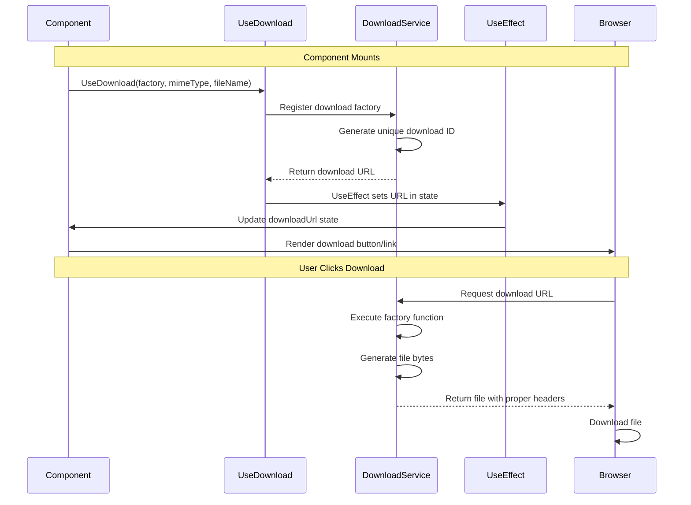

---
searchHints:
  - download
  - usedownload
  - file-download
  - blob
  - file-export
  - download-link
---

# Download

<Ingress>
The `UseDownload` [hook](../02_RulesOfHooks.md) enables file downloads in your [application](../../../01_Onboarding/02_Concepts/15_Apps.md), generating download links for files created on-demand or from existing data.
</Ingress>

## Overview

The `UseDownload` [hook](../02_RulesOfHooks.md) provides file download functionality:

- **On-Demand Generation** - Generate files dynamically when needed
- **Async Support** - Support for asynchronous file generation
- **MIME Types** - Specify content types for proper file handling
- **File Names** - Set custom file names for downloads
- **Automatic Cleanup** - Downloads are automatically cleaned up when components unmount

<Callout type="Tip">
`UseDownload` is perfect for generating files on-demand, such as CSV exports, PDF reports, or image downloads. The download URL is generated automatically and can be used with buttons or links.
</Callout>

## UseDownload vs Client.DownloadFile

Ivy provides two approaches for file downloads:

| Approach | Use Case | When to Use |
|----------|----------|-------------|
| `UseDownload` | Generate files on-demand with a factory function | When files need to be generated dynamically, especially based on component state |
| `IClientProvider.DownloadFile()` | Download existing data immediately | When you already have the file bytes and want immediate download |

### When to Use UseDownload

Use `UseDownload` when:

- Files need to be generated dynamically
- File generation depends on component [state](./03_State.md)
- You want to generate files lazily (only when the download link is clicked)
- File generation requires async operations

### When to Use Client.DownloadFile

Use `IClientProvider.DownloadFile()` when:

- You already have the file bytes in memory
- You want immediate download on button click
- You need progress tracking for large files
- File generation is simple and synchronous

```csharp
// Using IClientProvider.DownloadFile for immediate download
public class ImmediateDownloadView : ViewBase
{
    public override object? Build()
    {
        var client = UseService<IClientProvider>();
        var data = UseState(GetData());

        return new Button("Download Now", _ =>
        {
            var csvBytes = GenerateCsv(data.Value);
            client.DownloadFile("export.csv", csvBytes, "text/csv");
        });
    }
}
```

## Basic Usage

### Synchronous File Generation

For simple file generation that doesn't require async operations:

```csharp
public class SimpleDownloadView : ViewBase
{
    public override object? Build()
    {
        var downloadUrl = UseDownload(
            factory: () => System.Text.Encoding.UTF8.GetBytes("Hello, World!"),
            mimeType: "text/plain",
            fileName: "hello.txt"
        );

        if (downloadUrl.Value == null)
        {
            return Text.Literal("Preparing download...");
        }

        return new Button("Download File").Url(downloadUrl.Value);
    }
}
```

### Asynchronous File Generation

For file generation that requires async operations (API calls, database queries, etc.):

```csharp
public class AsyncDownloadView : ViewBase
{
    public override object? Build()
    {
        var downloadUrl = UseDownload(
            factory: async () =>
            {
                // Simulate async file generation
                await Task.Delay(1000);
                return System.Text.Encoding.UTF8.GetBytes("Generated content");
            },
            mimeType: "text/plain",
            fileName: "async-file.txt"
        );

        if (downloadUrl.Value == null)
        {
            return Text.Literal("Generating file...");
        }

        return new Button("Download").Url(downloadUrl.Value);
    }
}
```

## How Download Works

### Download Flow



### Download URL Generation

The download URL is generated automatically and follows this pattern:

```text
/ivy/download/{connectionId}/{downloadId}
```

- `connectionId` - Unique identifier for the current session
- `downloadId` - Unique identifier for this specific download

The URL is stored in [state](./03_State.md) and will be `null` until the download is registered.

## Examples

### CSV Export

Export data to CSV format:

```csharp
public class DataExportView : ViewBase
{
    public override object? Build()
    {
        var data = UseState(new[]
        {
            new { Name = "John", Email = "john@example.com", Age = 30 },
            new { Name = "Jane", Email = "jane@example.com", Age = 25 }
        });

        var downloadUrl = UseDownload(
            factory: () => Task.FromResult(GenerateCsv(data.Value)),
            mimeType: "text/csv",
            fileName: $"export-{DateTime.Now:yyyy-MM-dd}.csv"
        );

        if (downloadUrl.Value == null)
        {
            return Text.Literal("Preparing export...");
        }

        return Layout.Vertical(
            new Table(data.Value),
            new Button("Export to CSV").Url(downloadUrl.Value)
                .Variant(ButtonVariant.Primary)
        );
    }

    private byte[] GenerateCsv<T>(IEnumerable<T> items)
    {
        var csv = new System.Text.StringBuilder();
        
        // Get headers from first item
        var properties = typeof(T).GetProperties();
        csv.AppendLine(string.Join(",", properties.Select(p => p.Name)));
        
        // Add data rows
        foreach (var item in items)
        {
            var values = properties.Select(p => 
            {
                var value = p.GetValue(item);
                return value?.ToString()?.Replace(",", ";") ?? "";
            });
            csv.AppendLine(string.Join(",", values));
        }
        
        return System.Text.Encoding.UTF8.GetBytes(csv.ToString());
    }
}
```

### PDF Report Generation

Generate and download a PDF report:

```csharp
public class ReportView : ViewBase
{
    public override object? Build()
    {
        var reportData = UseQuery(
            key: "report-data",
            fetcher: async ct => await FetchReportData(ct)
        );

        var downloadUrl = UseDownload(
            factory: async () =>
            {
                if (reportData.Value == null)
                    return Array.Empty<byte>();

                // Generate PDF from report data
                return await GeneratePdfReport(reportData.Value);
            },
            mimeType: "application/pdf",
            fileName: $"report-{DateTime.Now:yyyy-MM-dd}.pdf"
        );

        if (reportData.Loading)
        {
            return Text.Literal("Loading report data...");
        }

        if (downloadUrl.Value == null)
        {
            return Text.Literal("Preparing report...");
        }

        return Layout.Vertical(
            new ReportDisplay(reportData.Value),
            new Button("Download PDF Report")
                .Url(downloadUrl.Value)
                .Variant(ButtonVariant.Primary)
        );
    }

    private Task<ReportData> FetchReportData(CancellationToken ct)
    {
        // Implementation
        return Task.FromResult(new ReportData());
    }

    private Task<byte[]> GeneratePdfReport(ReportData data)
    {
        // Implementation - use a PDF library like iTextSharp, QuestPDF, etc.
        return Task.FromResult(Array.Empty<byte>());
    }
}
```

### Image Download

Generate and download an image:

```csharp
public class ImageDownloadView : ViewBase
{
    public override object? Build()
    {
        var downloadUrl = UseDownload(
            factory: () => Task.FromResult(GenerateImage()),
            mimeType: "image/png",
            fileName: "generated-image.png"
        );

        if (downloadUrl.Value == null)
        {
            return Text.Literal("Generating image...");
        }

        return Layout.Vertical(
            new Image(downloadUrl.Value)
                .Width(400)
                .Height(300),
            new Button("Download Image")
                .Url(downloadUrl.Value)
                .Variant(ButtonVariant.Primary)
        );
    }

    private byte[] GenerateImage()
    {
        // Implementation - use ImageSharp, System.Drawing, etc.
        // This is a simplified example
        using var image = new System.Drawing.Bitmap(400, 300);
        using var graphics = System.Drawing.Graphics.FromImage(image);
        graphics.Clear(System.Drawing.Color.Blue);
        graphics.DrawString("Generated Image", 
            new System.Drawing.Font("Arial", 20), 
            System.Drawing.Brushes.White, 
            new System.Drawing.PointF(100, 100));
        
        using var ms = new MemoryStream();
        image.Save(ms, System.Drawing.Imaging.ImageFormat.Png);
        return ms.ToArray();
    }
}
```

### Dynamic File Based on State

Generate files based on component [state](./03_State.md):

```csharp
public class DynamicExportView : ViewBase
{
    public override object? Build()
    {
        var format = UseState("csv");
        var includeHeaders = UseState(true);
        var data = UseState(GetData());

        var downloadUrl = UseDownload(
            factory: () => Task.FromResult(
                format.Value == "csv" 
                    ? GenerateCsv(data.Value, includeHeaders.Value)
                    : GenerateJson(data.Value)
            ),
            mimeType: format.Value == "csv" ? "text/csv" : "application/json",
            fileName: $"export-{DateTime.Now:yyyy-MM-dd}.{format.Value}"
        );

        return Layout.Vertical(
            Layout.Horizontal(
                new Select("Format", format.Value, 
                    new[] { "csv", "json" }, 
                    v => format.Set(v)),
                includeHeaders.ToBoolInput("Include Headers")
            ),
            downloadUrl.Value != null
                ? new Button($"Download {format.Value.ToUpper()}")
                    .Url(downloadUrl.Value)
                : Text.Literal("Preparing download...")
        );
    }

    private List<DataItem> GetData()
    {
        return new List<DataItem>
        {
            new DataItem { Id = 1, Name = "Item 1" },
            new DataItem { Id = 2, Name = "Item 2" }
        };
    }

    private byte[] GenerateCsv(List<DataItem> items, bool includeHeaders)
    {
        var csv = new System.Text.StringBuilder();
        if (includeHeaders)
        {
            csv.AppendLine("Id,Name");
        }
        foreach (var item in items)
        {
            csv.AppendLine($"{item.Id},{item.Name}");
        }
        return System.Text.Encoding.UTF8.GetBytes(csv.ToString());
    }

    private byte[] GenerateJson(List<DataItem> items)
    {
        var json = System.Text.Json.JsonSerializer.Serialize(items);
        return System.Text.Encoding.UTF8.GetBytes(json);
    }
}

public class DataItem
{
    public int Id { get; set; }
    public string Name { get; set; } = "";
}
```

## Alternative: Client.DownloadFile

For immediate downloads of existing data, you can use `IClientProvider.DownloadFile()` instead of `UseDownload`:

```csharp
public class ImmediateDownloadView : ViewBase
{
    public override object? Build()
    {
        var client = UseService<IClientProvider>();
        var data = UseState(GetData());

        return new Button("Download CSV", _ =>
        {
            var csvBytes = GenerateCsv(data.Value);
            client.DownloadFile("export.csv", csvBytes, "text/csv");
        });
    }
}
```

### Progress Tracking with Client.DownloadFile

`IClientProvider.DownloadFile()` supports progress tracking for large files:

```csharp
public class ProgressDownloadView : ViewBase
{
    public override object? Build()
    {
        var client = UseService<IClientProvider>();
        var progress = UseState(0.0);
        var data = UseState(GetLargeData());

        return Layout.Vertical(
            progress.Value > 0 && progress.Value < 1
                ? Layout.Vertical(
                    Text.Literal($"Downloading... {progress.Value:P0}"),
                    new ProgressBar(progress.Value)
                )
                : null,
            new Button("Download Large File", _ =>
            {
                var fileBytes = GenerateLargeFile(data.Value);
                client.DownloadFile(
                    "large-file.zip",
                    fileBytes,
                    contentType: "application/zip",
                    onProgress: p => progress.Set(p)
                );
            })
        );
    }
}
```

### When to Use Each Approach

| Scenario | Recommended Approach |
|----------|---------------------|
| Generate file on-demand based on state | `UseDownload` |
| Generate file lazily (only when clicked) | `UseDownload` |
| Download existing data immediately | `IClientProvider.DownloadFile()` |
| Need progress tracking | `IClientProvider.DownloadFile()` |
| Simple synchronous file generation | Either approach works |
| Complex async file generation | `UseDownload` |

## Best Practices

### Check for Null URL

Always check if the download URL is null before using it:

```csharp
// Good: Null check
var downloadUrl = UseDownload(...);
if (downloadUrl.Value == null)
{
    return Text.Literal("Preparing download...");
}
return new Button("Download").Url(downloadUrl.Value);

// Bad: No null check
var downloadUrl = UseDownload(...);
return new Button("Download").Url(downloadUrl.Value); // Could throw
```

### Use Appropriate MIME Types

Always specify the correct MIME type for proper file handling:

```csharp
// Good: Correct MIME types
UseDownload(..., mimeType: "text/csv", fileName: "data.csv");
UseDownload(..., mimeType: "application/pdf", fileName: "report.pdf");
UseDownload(..., mimeType: "application/json", fileName: "data.json");
UseDownload(..., mimeType: "image/png", fileName: "image.png");

// Bad: Generic or incorrect MIME types
UseDownload(..., mimeType: "application/octet-stream", fileName: "data.csv");
UseDownload(..., mimeType: "text/plain", fileName: "report.pdf");
```

### Use Descriptive File Names

Include timestamps or identifiers in file names:

```csharp
// Good: Descriptive file names
fileName: $"export-{DateTime.Now:yyyy-MM-dd}.csv"
fileName: $"report-{userId}-{DateTime.Now:yyyyMMddHHmmss}.pdf"
fileName: $"data-{category}-{version}.json"

// Bad: Generic file names
fileName: "file.csv"
fileName: "download.pdf"
fileName: "data.json"
```

### Handle Async Operations Properly

Use the async overload for operations that require async:

```csharp
// Good: Async for async operations
var downloadUrl = UseDownload(
    factory: async () =>
    {
        var data = await FetchDataFromApi();
        return GenerateFile(data);
    },
    ...
);

// Less ideal: Wrapping async in sync
var downloadUrl = UseDownload(
    factory: () => FetchDataFromApi().Result, // Blocks thread
    ...
);
```

### Clean Up Large Files

For large file generation, consider cleanup:

```csharp
// Good: Dispose resources properly
var downloadUrl = UseDownload(
    factory: async () =>
    {
        using var stream = new MemoryStream();
        // Generate file...
        return stream.ToArray();
    },
    ...
);
```

## Common Patterns

### Export Button

Simple export button pattern:

```csharp
public class ExportButton : ViewBase
{
    private readonly Func<Task<byte[]>> _fileGenerator;
    private readonly string _fileName;

    public ExportButton(Func<Task<byte[]>> fileGenerator, string fileName)
    {
        _fileGenerator = fileGenerator;
        _fileName = fileName;
    }

    public override object? Build()
    {
        var downloadUrl = UseDownload(_fileGenerator, "application/octet-stream", _fileName);

        if (downloadUrl.Value == null)
        {
            return new Button("Exporting...").Disabled();
        }

        return new Button("Export").Url(downloadUrl.Value);
    }
}
```

### Multiple Format Exports

Allow users to choose export format:

```csharp
public class MultiFormatExportView : ViewBase
{
    public override object? Build()
    {
        var format = UseState("csv");
        var data = UseState(GetData());

        var csvUrl = UseDownload(
            factory: () => Task.FromResult(GenerateCsv(data.Value)),
            mimeType: "text/csv",
            fileName: "export.csv"
        );

        var jsonUrl = UseDownload(
            factory: () => Task.FromResult(GenerateJson(data.Value)),
            mimeType: "application/json",
            fileName: "export.json"
        );

        return Layout.Horizontal(
            csvUrl.Value != null
                ? new Button("CSV").Url(csvUrl.Value)
                : null,
            jsonUrl.Value != null
                ? new Button("JSON").Url(jsonUrl.Value)
                : null
        );
    }
}
```

### Conditional Download

Show download button only when data is ready:

```csharp
public class ConditionalDownloadView : ViewBase
{
    public override object? Build()
    {
        var data = UseQuery(
            key: "export-data",
            fetcher: async ct => await FetchData(ct)
        );

        var downloadUrl = UseDownload(
            factory: async () =>
            {
                if (data.Value == null)
                    return Array.Empty<byte>();
                return GenerateFile(data.Value);
            },
            mimeType: "text/csv",
            fileName: "export.csv"
        );

        if (data.Loading)
        {
            return Text.Literal("Loading data...");
        }

        if (data.Value == null || downloadUrl.Value == null)
        {
            return Text.Literal("No data to export");
        }

        return new Button("Download").Url(downloadUrl.Value);
    }
}
```

## Troubleshooting

### Download URL Is Always Null

If the download URL is always null, check:

1. **Factory function completes successfully**:

```csharp
// Good: Factory returns bytes
var downloadUrl = UseDownload(
    factory: () => Task.FromResult(new byte[] { 1, 2, 3 }),
    ...
);

// Bad: Factory throws exception
var downloadUrl = UseDownload(
    factory: () => throw new Exception("Error"),
    ...
);
```

1. **UseEffect runs properly**:

The download URL is set in a [UseEffect](./04_Effect.md), so ensure the component renders properly and effects can run.

### File Downloads But Is Corrupted

If files download but are corrupted:

1. **Check MIME type matches file content**:

```csharp
// Good: MIME type matches content
UseDownload(..., mimeType: "text/csv", fileName: "data.csv");
UseDownload(..., mimeType: "application/pdf", fileName: "report.pdf");

// Bad: MIME type doesn't match
UseDownload(..., mimeType: "text/plain", fileName: "report.pdf");
```

1. **Ensure proper encoding**:

```csharp
// Good: Proper encoding for text files
var bytes = System.Text.Encoding.UTF8.GetBytes(csvContent);

// Bad: Wrong encoding
var bytes = System.Text.Encoding.ASCII.GetBytes(csvContent); // May lose special characters
```

### Large Files Cause Performance Issues

For large files:

1. **Use async generation**:

```csharp
// Good: Async generation for large files
var downloadUrl = UseDownload(
    factory: async () => await GenerateLargeFile(),
    ...
);
```

1. **Consider streaming for very large files**:

For extremely large files, consider using a different approach or breaking files into chunks.

## See Also

- [State](./03_State.md) - Component state management
- [Effects](./04_Effect.md) - Side effects and lifecycle
- [Clients](../../../01_Onboarding/02_Concepts/19_Clients.md) - Client-side interactions including `DownloadFile()`
- [Rules of Hooks](../02_RulesOfHooks.md) - Understanding hook rules and best practices
- [Views](../../../01_Onboarding/02_Concepts/02_Views.md) - Understanding Ivy views and components
