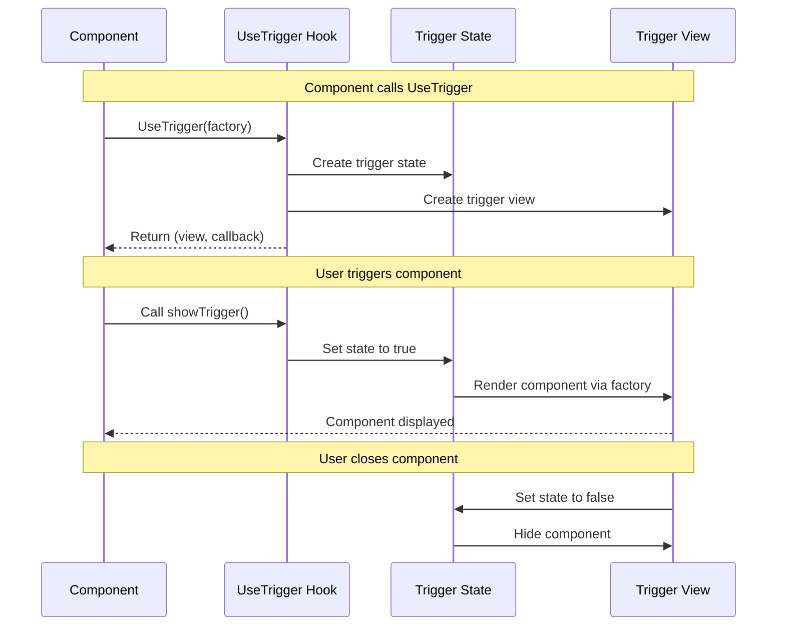

---
searchHints:
  - trigger
  - usetrigger
  - modal
  - dialog
  - popup
  - conditional-render
  - show-hide
---

# Trigger

<Ingress>
The `UseTrigger` [hook](../02_RulesOfHooks.md) provides a way to conditionally render [components](../../../01_Onboarding/02_Concepts/02_Views.md) based on trigger state, commonly used for modals, dialogs, and other conditional UI elements. It manages visibility state and provides a callback to show the triggered component.
</Ingress>

## Overview

The `UseTrigger` [hook](../02_RulesOfHooks.md) enables conditional component rendering:

- **Conditional Rendering** - Show or hide components based on trigger state
- **Modal Support** - Perfect for modals, dialogs, and popups
- **State Management** - Automatic state management for trigger visibility
- **Callback Control** - Trigger callbacks to show or hide components
- **Value Passing** - Pass values to triggered components when showing them

<Callout type="info">
`UseTrigger` is ideal for conditional UI elements like modals, dialogs, dropdowns, and other components that need to be shown or hidden programmatically. The hook manages the visibility state internally and provides a callback to trigger the component display.
</Callout>

## Basic Usage

Use `UseTrigger` when you need to show/hide a component without passing parameters:

```csharp
public class SimpleTriggerExample : ViewBase
{
    public override object? Build()
    {
        var (triggerView, showTrigger) = UseTrigger((IState<bool> isOpen) =>
            isOpen.Value ? new ModalDialog(isOpen) : null);

        return Layout.Vertical()
            | new Button("Show Modal", onClick: _ => showTrigger())
            | triggerView;
    }
}

public class ModalDialog(IState<bool> isOpen) : ViewBase
{
    public override object? Build()
    {
        return Layout.Vertical()
            | Text.Block("This is a modal dialog")
            | new Button("Close", onClick: _ => isOpen.Set(false));
    }
}
```

### Trigger with Parameters

Use `UseTrigger<T>` when you need to pass data to the triggered component:

```csharp
public class TriggerWithParamsExample : ViewBase
{
    public override object? Build()
    {
        var (triggerView, showTrigger) = UseTrigger((IState<bool> isOpen, int itemId) =>
            new ItemDetailDialog(isOpen, itemId));

        return Layout.Vertical()
            | new Button("Show Item 1", onClick: _ => showTrigger(1))
            | new Button("Show Item 2", onClick: _ => showTrigger(2))
            | triggerView;
    }
}

public class ItemDetailDialog(IState<bool> isOpen, int itemId) : ViewBase
{
    public override object? Build()
    {
        if (!isOpen.Value) return null;

        return Layout.Vertical()
            | Text.Block($"Details for Item {itemId}")
            | new Button("Close", onClick: _ => isOpen.Set(false));
    }
}
```

## How Trigger Works

### Trigger Flow



### Trigger State Management

The `UseTrigger` hook manages visibility state internally:

- **Trigger State** - Internal state managed by the hook
- **Factory Function** - Creates the component when triggered
- **Callback Function** - Programmatically shows the component
- **Visibility Control** - Component is only rendered when trigger state is true

## Examples

### Modal Dialog

Create a simple modal dialog using `UseTrigger`:

```csharp
public class ModalDialogExample : ViewBase
{
    public override object? Build()
    {
        var (dialogView, showDialog) = UseTrigger((IState<bool> isOpen) =>
            isOpen.Value ? new ConfirmationDialog(isOpen) : null);

        return Layout.Vertical()
            | new Button("Open Dialog", onClick: _ => showDialog())
            | dialogView;
    }
}

public class ConfirmationDialog(IState<bool> isOpen) : ViewBase
{
    public override object? Build()
    {
        return Layout.Vertical().Gap(2)
            | Text.Block("Are you sure you want to continue?")
            | Layout.Horizontal().Gap(2)
                | new Button("Confirm", onClick: _ => isOpen.Set(false))
                | new Button("Cancel", onClick: _ => isOpen.Set(false));
    }
}
```

### Detail View with Data

Pass data to the triggered component:

```csharp
public record UserInfo(int Id, string Name, string Email);

public class UserListExample : ViewBase
{
    public override object? Build()
    {
        var users = UseState(new[]
        {
            new UserInfo(1, "Alice", "alice@example.com"),
            new UserInfo(2, "Bob", "bob@example.com")
        });

        var (detailView, showDetail) = UseTrigger((IState<bool> isOpen, UserInfo user) =>
            new UserDetailView(isOpen, user));

        return Layout.Vertical()
            | new List(users.Value.Select(user =>
                new ListItem(user.Name, onClick: _ => showDetail(user))))
            | detailView;
    }
}

public class UserDetailView(IState<bool> isOpen, UserInfo user) : ViewBase
{
    public override object? Build()
    {
        if (!isOpen.Value) return null;

        return Layout.Vertical().Gap(2)
            | Text.Block($"Name: {user.Name}")
            | Text.Block($"Email: {user.Email}")
            | new Button("Close", onClick: _ => isOpen.Set(false));
    }
}
```

### Edit Form Trigger

Use trigger for edit forms in data tables:

```csharp
public class DataTableEditExample : ViewBase
{
    public override object? Build()
    {
        var items = UseState(new[] { "Item 1", "Item 2", "Item 3" });

        var (editView, showEdit) = UseTrigger((IState<bool> isOpen, int index) =>
            new EditForm(isOpen, items, index));

        return Layout.Vertical()
            | new List(items.Value.Select((item, index) =>
                new ListItem(item, onClick: _ => showEdit(index))))
            | editView;
    }
}

public class EditForm(IState<bool> isOpen, IState<string[]> items, int index) : ViewBase
{
    public override object? Build()
    {
        if (!isOpen.Value) return null;

        var value = UseState(items.Value[index]);

        return Layout.Vertical().Gap(2)
            | value.ToTextInput()
            | Layout.Horizontal().Gap(2)
                | new Button("Save", onClick: _ =>
                {
                    var updated = items.Value.ToArray();
                    updated[index] = value.Value;
                    items.Set(updated);
                    isOpen.Set(false);
                })
                | new Button("Cancel", onClick: _ => isOpen.Set(false));
    }
}
```

## Best Practices

### Always Check Visibility State

Check the visibility state in your triggered component to handle unmounting:

```csharp
// Good: Check state before rendering
public override object? Build()
{
    if (!isOpen.Value) return null;
    return Layout.Vertical() | Text.Block("Content");
}

// Avoid: Rendering content when not visible
public override object? Build()
{
    return Layout.Vertical() | Text.Block("Content"); // Always rendered
}
```

### Close State Management

Use the provided state to close the triggered component:

```csharp
// Good: Use state to close
new Button("Close", onClick: _ => isOpen.Set(false))

// Avoid: Don't try to manipulate trigger directly
```

### Use Appropriate Overload

Choose the right overload based on whether you need to pass parameters:

```csharp
// Use simple overload when no parameters needed
var (view, show) = UseTrigger((IState<bool> isOpen) => new Dialog(isOpen));

// Use generic overload when passing data
var (view, show) = UseTrigger((IState<bool> isOpen, string id) => new Dialog(isOpen, id));
```

### Include Trigger View in Layout

Always include the trigger view in your component's return value:

```csharp
// Good: Include trigger view
return Layout.Vertical()
    | content
    | triggerView;

// Bad: Forgot to include trigger view - component won't appear
return Layout.Vertical() | content;
```

## Common Patterns

### Confirmation Dialogs

Use trigger for confirmation dialogs before actions:

```csharp
public class DeleteConfirmationExample : ViewBase
{
    public override object? Build()
    {
        var items = UseState(new List<string> { "Item 1", "Item 2" });

        var (confirmView, showConfirm) = UseTrigger((IState<bool> isOpen, int index) =>
            new DeleteConfirmDialog(isOpen, () => 
            {
                var list = items.Value.ToList();
                list.RemoveAt(index);
                items.Set(list);
            }));

        return Layout.Vertical()
            | new List(items.Value.Select((item, index) =>
                new ListItem(item, onClick: _ => showConfirm(index))))
            | confirmView;
    }
}
```

### Detail Sheets

Use trigger with Sheet widget for detail views:

```csharp
public class DetailSheetExample : ViewBase
{
    public override object? Build()
    {
        var (sheetView, showDetail) = UseTrigger((IState<bool> isOpen, string itemId) =>
            new DetailSheet(isOpen, itemId));

        return Layout.Vertical()
            | new Button("Show Details", onClick: _ => showDetail("item-1"))
            | sheetView;
    }
}
```

### Multi-Step Forms

Use trigger to show different steps in a multi-step form:

```csharp
public class MultiStepFormExample : ViewBase
{
    public override object? Build()
    {
        var (formView, showForm) = UseTrigger((IState<bool> isOpen, int step) =>
            new FormStep(isOpen, step));

        return Layout.Vertical()
            | new Button("Start Form", onClick: _ => showForm(1))
            | formView;
    }
}
```

## Troubleshooting

### Trigger View Not Showing

Ensure the trigger view is included in your component's return value:

```csharp
// Error: Trigger view not included
public override object? Build()
{
    var (triggerView, showTrigger) = UseTrigger(...);
    return Layout.Vertical() | new Button("Show", onClick: _ => showTrigger());
    // Missing: triggerView
}

// Solution: Include trigger view
public override object? Build()
{
    var (triggerView, showTrigger) = UseTrigger(...);
    return Layout.Vertical()
        | new Button("Show", onClick: _ => showTrigger())
        | triggerView; // Include trigger view
}
```

### State Not Updating

Use the provided `IState<bool>` parameter to control visibility:

```csharp
// Correct: Use provided state
public override object? Build()
{
    if (!isOpen.Value) return null;
    return Layout.Vertical()
        | new Button("Close", onClick: _ => isOpen.Set(false));
}

// Incorrect: Don't create your own state
public override object? Build()
{
    var myState = UseState(false); // Wrong - use provided isOpen
    return Layout.Vertical();
}
```

### Parameter Type Mismatch

Ensure the callback type matches the factory parameter type:

```csharp
// Correct: Types match
var (view, show) = UseTrigger((IState<bool> isOpen, int id) => new Dialog(isOpen, id));
show(123); // int matches

// Incorrect: Type mismatch
var (view, show) = UseTrigger((IState<bool> isOpen, int id) => new Dialog(isOpen, id));
show("123"); // string doesn't match int
```

## See Also

- [State](./03_State.md) - Component state management
- [Effect](./04_Effect.md) - Side effects and lifecycle
- [Rules of Hooks](../02_RulesOfHooks.md) - Understanding hook rules and best practices
- [Views](../../../01_Onboarding/02_Concepts/02_Views.md) - Understanding Ivy views and components
