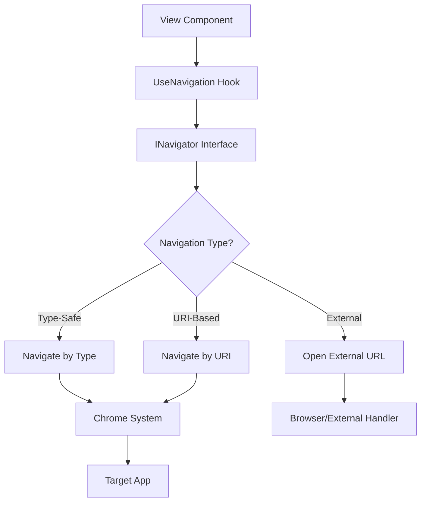

---
searchHints:
  - navigation
  - usenavigation
  - navigate
  - routing
  - route
  - navigation-args
---

# Navigation

<Ingress>
The `UseNavigation` [hook](../02_RulesOfHooks.md) provides navigation capabilities, allowing you to programmatically navigate between [apps](../../../01_Onboarding/02_Concepts/15_Apps.md) and routes in your [application](../../../01_Onboarding/02_Concepts/15_Apps.md). It returns an `INavigator` interface that enables type-safe navigation, argument passing, and external URL navigation.
</Ingress>

## Overview

The `UseNavigation` [hook](../02_RulesOfHooks.md) enables programmatic navigation:

- **Type-Safe Navigation** - Navigate to apps using strongly-typed app classes
- **URI-Based Navigation** - Navigate using URI strings for dynamic scenarios
- **Navigation Arguments** - Pass data to target apps during navigation
- **External URL Navigation** - Open external websites and resources
- **App Integration** - Seamlessly integrates with the [Chrome framework](../../../01_Onboarding/02_Concepts/16_Chrome.md) for app lifecycle management

<Callout type="info">
The `UseNavigation` hook returns an `INavigator` interface. The navigation system is built on top of Ivy's [signal system](./10_Signal.md) and integrates with the Chrome framework for managing app lifecycle and routing.
</Callout>

## Basic Usage

### Getting the Navigator

Call `UseNavigation()` to get an `INavigator` instance:

```csharp
[App(icon: Icons.Navigation)]
public class NavigationBasicDemoApp : ViewBase
{
    public override object? Build()
    {
        // Get the navigator instance
        var navigator = UseNavigation();
        
        return new Button("Go to UseState docs")
            .HandleClick(() => navigator.Navigate(typeof(StateApp)));
    }
}
```

### Navigation Methods

The `INavigator` interface provides navigation methods:

```csharp
public interface INavigator
{
    // Navigate using app type (type-safe)
    void Navigate(Type type, object? appArgs = null);
    
    // Navigate using URI string (flexible)
    void Navigate(string uri, object? appArgs = null);
}
```

## How Navigation Works

### Navigation Flow



### Navigation Modes

Navigation behavior depends on Chrome settings:

- **Tabs Mode** (default): Each navigation creates a new tab
- **Pages Mode**: Navigation replaces the current view
- **Prevent Duplicates**: Avoid opening multiple tabs for the same app

## Examples

### Type-Safe Navigation

Navigate to apps using their class types for compile-time safety:

```csharp
[App(icon: Icons.LayoutDashboard)]
public class NavigationTypeSafeDemoApp : ViewBase
{
    public override object? Build()
    {
        var navigator = UseNavigation();
        
        return Layout.Vertical()
            | new Button("Go to User Profile")
                .HandleClick(() => navigator.Navigate(typeof(StateApp)))
            | new Button("Open Settings")
                .HandleClick(() => navigator.Navigate(typeof(EffectApp)))
            | new Button("View Reports")
                .HandleClick(() => navigator.Navigate(typeof(ArgsApp)));
    }
}
```

### Navigation with Arguments

Pass data to target apps using strongly-typed arguments:

```csharp
public record UserProfileArgs(int UserId, string Tab = "overview");

[App(icon: Icons.Users)]
public class NavigationWithArgsDemoApp : ViewBase
{
    public override object? Build()
    {
        var navigator = UseNavigation();
        
        return Layout.Vertical().Gap(2)
            | Text.Block("Navigate and pass typed arguments:")
            | new Button("Open Args docs (userId=123)")
                .HandleClick(() => navigator.Navigate(typeof(ArgsApp), new UserProfileArgs(123, "details")));
    }
}
```

### URI-Based Navigation

Use URI strings for dynamic navigation scenarios:

```csharp
[App(icon: Icons.Navigation)]
public class NavigationUriDemoApp : ViewBase
{
    public override object? Build()
    {
        var navigator = UseNavigation();
        var selectedApp = UseState("dashboard");
        
        return Layout.Vertical()
            | new Field(
                selectedApp.ToSelectInput(new[] { 
                    "dashboard", "users", "settings", "reports" 
                }.ToOptions()),
                "Select App"
            )
            | new Button("Navigate", onClick: _ =>
            {
                var appUri = $"app://{selectedApp.Value}";
                navigator.Navigate(appUri);
            });
    }
}
```

### External URL Navigation

Open external websites and resources:

```csharp
[App(icon: Icons.ExternalLink)]
public class NavigationExternalLinksDemoApp : ViewBase
{
    public override object? Build()
    {
        var navigator = UseNavigation();
        
        return Layout.Vertical()
            | new Button("Open Documentation")
                .HandleClick(() => navigator.Navigate("https://docs.ivy-framework.com"))
            | new Button("Open GitHub")
                .HandleClick(() => navigator.Navigate("https://github.com/ivy-framework/ivy"))
            | new Button("Send Email")
                .HandleClick(() => navigator.Navigate("mailto:support@example.com"));
    }
}
```

## Best Practices

### Prefer Type-Safe Navigation

Use type-safe navigation when the app type is known at compile time:

```csharp
// Prefer type-safe navigation when the target is known at compile time:
var navigator = UseNavigation();
navigator.Navigate(typeof(StateApp));

// Use URI navigation for dynamic scenarios:
navigator.Navigate("app://hooks/core/state");
```

### Use Navigation Arguments for Data Passing

Pass data using strongly-typed argument objects:

```csharp
// You can pass any object as navigation args (often a record):
public record DemoArgs(int Id, string Mode);

navigator.Navigate(typeof(ArgsApp), new DemoArgs(123, "details"));
```

### Handle Navigation Errors

Ensure target apps exist and have the `[App]` attribute:

```csharp
[App(icon: Icons.LayoutDashboard)]
public class MyApp : ViewBase { }
```

## Common Patterns

### Master-Detail Navigation

Navigate from list views to detail views:

```csharp
[App(icon: Icons.List)]
public class NavigationMasterDetailDemoApp : ViewBase
{
    public override object? Build()
    {
        var navigator = UseNavigation();
        var items = new[]
        {
            new DemoItem(1, "Item 1"),
            new DemoItem(2, "Item 2"),
        };

        return new List(items.Select(item =>
            new ListItem(item.Name, onClick: _ =>
                // Use ArgsApp as a simple destination to demonstrate passing IDs
                navigator.Navigate(typeof(ArgsApp), new { ItemId = item.Id }))
        ));
    }

    public record DemoItem(int Id, string Name);
}
```

### Conditional Navigation

Navigate based on user permissions or state:

```csharp
[App(icon: Icons.Settings)]
public class NavigationConditionalDemoApp : ViewBase
{
    public override object? Build()
    {
        var navigator = UseNavigation();
        var isAdmin = UseState(false);

        return Layout.Vertical().Gap(2)
            | new Button(isAdmin.Value ? "Role: Admin" : "Role: User", onClick: _ => isAdmin.Set(!isAdmin.Value))
            | new Button("Go", onClick: _ =>
            {
                // Pick a destination based on state
                navigator.Navigate(isAdmin.Value ? typeof(EffectApp) : typeof(StateApp));
            });
    }
}
```

### Navigation Helpers

Create reusable navigation patterns:

```csharp
public static class NavigationHelpers
{
    public static Action<string> UseLinks(this IViewContext context)
    {
        var navigator = context.UseNavigation();
        return uri => navigator.Navigate(uri);
    }
    
    public static Action UseBackNavigation(this IViewContext context, string defaultApp = "app://dashboard")
    {
        var navigator = context.UseNavigation();
        return () => navigator.Navigate(defaultApp);
    }
}

// Usage
var navigateToLink = UseLinks();
var goBack = UseBackNavigation();
```

## Troubleshooting

### App Not Found Error

Ensure your app has the `[App]` attribute:

```csharp
// Error: App not found
public class MyApp : ViewBase { }

// Solution: Add [App] attribute
[App(icon: Icons.LayoutDashboard)]
public class MyApp : ViewBase { }
```

### Navigation Arguments Not Received

Ensure argument types match exactly between source and target apps:

```csharp
// Source app
navigator.Navigate(typeof(TargetApp), new MyArgs("value"));

// Target app - must use the same type
public class TargetApp : ViewBase
{
    public override object? Build()
    {
        var args = UseArgs<MyArgs>(); // Same type as source
        return Text.Block(args?.Value);
    }
}
```

### External URLs Not Opening

Include the protocol in external URLs:

```csharp
// Correct: Include protocol
navigator.Navigate("https://example.com");
navigator.Navigate("mailto:support@example.com");

// Incorrect: Missing protocol - treated as app URI
navigator.Navigate("example.com"); // Won't open externally
```

### Navigation Not Working

Check that navigation is called from within a view context:

```csharp
// Correct: UseNavigation() in Build method
public override object? Build()
{
    var navigator = UseNavigation();
    return new Button("Navigate", onClick: _ => navigator.Navigate(typeof(TargetApp)));
}

// Incorrect: Cannot use outside view context
public void SomeMethod()
{
    var navigator = UseNavigation(); // Error: Not in view context
}
```

## See Also

- [Navigation Concepts](../../../01_Onboarding/02_Concepts/14_Navigation.md) - Complete navigation documentation
- [Chrome Framework](../../../01_Onboarding/02_Concepts/16_Chrome.md) - App lifecycle and routing
- [App Arguments](./13_Args.md) - Receiving navigation arguments
- [Signals](./10_Signal.md) - Navigation signal system
- [State Management](./03_State.md) - Managing state during navigation
- [Rules of Hooks](../02_RulesOfHooks.md) - Understanding hook rules and best practices
